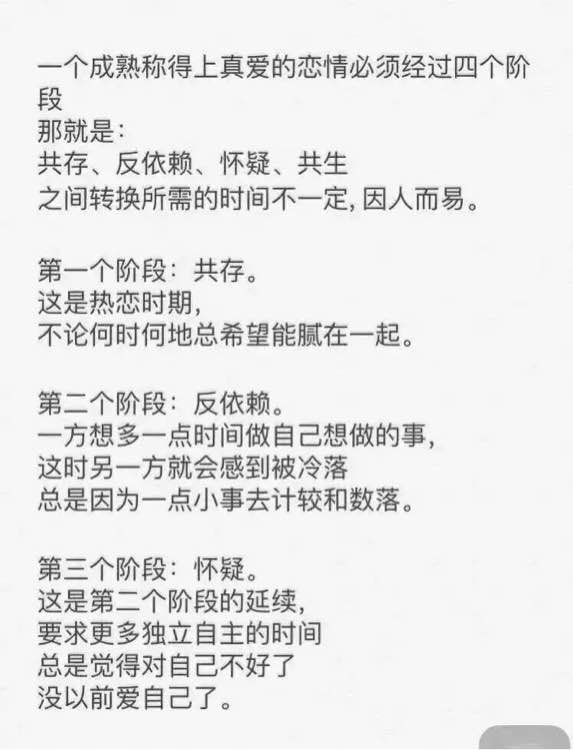
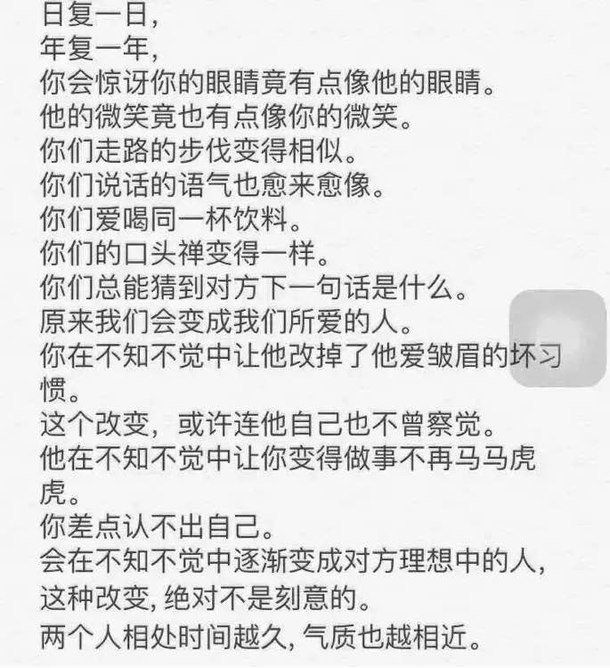
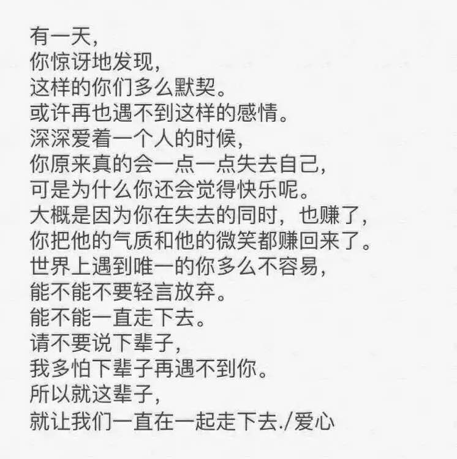

# 致信仰式的生活

> 将未来交给上天安排，将过去交与地府审判，将当下交己精进修行。

## 出海冲浪

> 高度自由背后如果没有高度的自制，那将是灾难。

### chrome 插件推荐

- AntiPorn

### 心理防火墙

> 正确的价值观，哪管巨浪涛天（才不会翻船）；
>
> 修身心以养正气；

- 戒色吧（ 人哪总会经历各种各样的:) ）
- 南怀谨国学系列

## 斋戒

### 八关斋戒

- [wiki](https://baike.baidu.com/item/%E5%85%AB%E5%85%B3%E6%96%8B%E6%88%92)
- 只限于日出至中午进食，此外则不再进食
- [关于日出、日中时间查询](https://richurimo.51240.com/shanghai__richurimo/)
- 过了中午以后到次日清晨之前，这段时间只可饮用各种糖水，果汁（滤清无渣），姜汤，盐水，葡萄糖水。但豆浆，芝麻糊以及糕饼，面食等，律中不许饮用，食则违犯。
- 不非时食 “非时”指日中至次日清晨，即过午不食。过午不食叫“持斋”，“持斋”虽不是戒，却是戒之体，是八关斋戒中最重要的一条。吃素不等于持斋，“斋”含有内心清净，摒绝杂乱的意思。从事相上说，过中午而食者，即为杂乱不净。所以，三世诸佛都是过午不食。从根本上说，必须身，口，意三业清净，才叫“斋”。不问在家出家，要净化三业，均应持斋。

### 巴哈伊斋戒

- 公历的3月1日-3月19日
- 每天从日出到日落这段时间内不得饮食
- 斋戒只是一种象征。持斋表示禁戒种种物欲，身体的斋戒象征禁欲，意在提醒注意。换言之，一个戒绝了物质嗜欲的人，也就戒除了自私的欲念和需求。仅仅禁食，是对灵性无作用的。它只是提醒人们的一种表记。否则，便不足重视了。为这样的目的而守斋，并非完全断食之意。最好的方法是不摄取太多的食物，也不可太少，必需适度。印度有一教派，实为极端的禁食，逐渐减少直至几乎全不进食，但智力遭受损害。因缺乏食物而智慧与身体均趋衰弱的人，是不适于为上帝服务的。

<!-- 
# 别人的恋爱心得

> 除了用心，还需要克制

 -->
