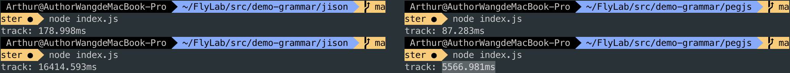

# Generator Parser/Grammar

> 解析表达式文法 😀 Pegjs v0.10.0

## Pegjs  vs Jison 性能对比

> Nodejs Generator Parser

### 运行平台

- Node Version: 12.4.0
- MacBook Pro 13寸 双核 i5

## 文法

- 上下文无关文法
- 解析表达文法

## 

## 参考

- [自己动手写编译器](https://pandolia.net/tinyc/index.html)

- [斯坦福-编译课程](http://web.stanford.edu/class/archive/cs/cs143/cs143.1128/)

- [Rustc Development指南](https://rust-lang.github.io/rustc-guide/compiler-team.html)

- https://www.reddit.com/r/rust/comments/9runrj/is_rust_compiler_written_in_cc_using_bisonflex/

- [构造有限自动机示例](http://ccl.pku.edu.cn/doubtfire/Course/Computational%20Linguistics/contents/Chapter_02_pdf_FSA_Examples.pdf)

- [利用有限自动机分析正则表达式
](https://cn.charlee.li/parse-regex-with-dfa.html)

- [编译原理算法实现](https://www.kancloud.cn/digest/compile-principle/143011)

- [tcc doc](https://bellard.org/tcc/tcc-doc.html)

- [Wiki 上下文无关文法](https://en.wikipedia.org/wiki/Parsing_expression_grammar)

- [CYK算法](https://zh.wikipedia.org/wiki/CYK%E7%AE%97%E6%B3%95)

- [解析器与舞台剧](https://www.kancloud.cn/wizardforcel/go-blog-in-action/146840)

- [一种可扩展的表达式解析及计算方法](https://www.ibm.com/developerworks/cn/java/j-lo-expressparse/index.html)

- [AST抽象语法树](https://segmentfault.com/a/1190000016231512)

- [王垠对Parser认识](https://www.yinwang.org/blog-cn/2015/09/19/parser)

- [pegjs](https://www.wangming.co/2018/12/15/pegjs-document/#%E8%A7%A3%E6%9E%90%E8%A1%A8%E8%BE%BE%E5%BC%8F%E7%B1%BB%E5%9E%8B)

- https://www.codercto.com/a/38880.html

- https://www.codercto.com/a/45502.html